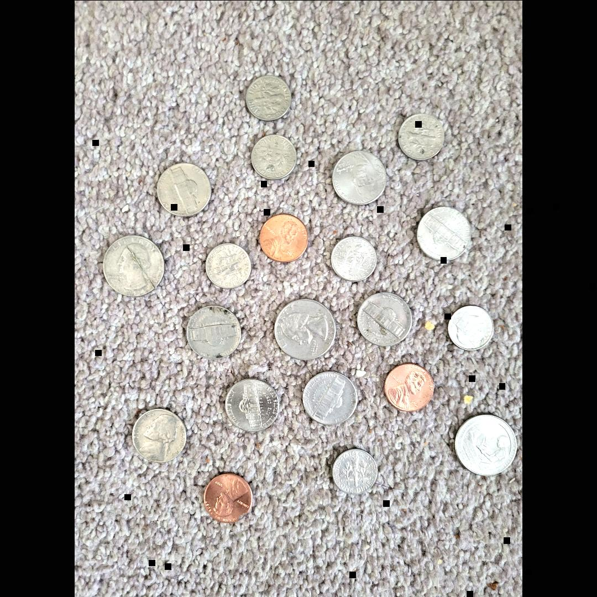
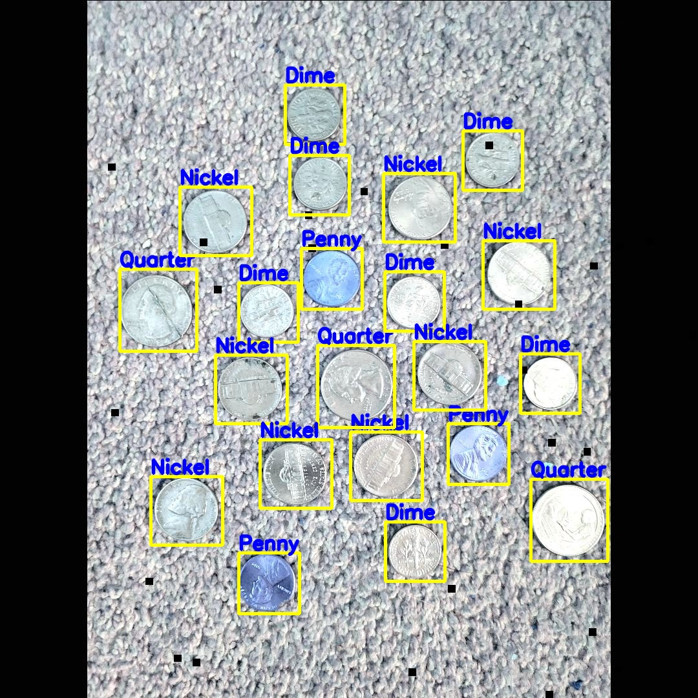
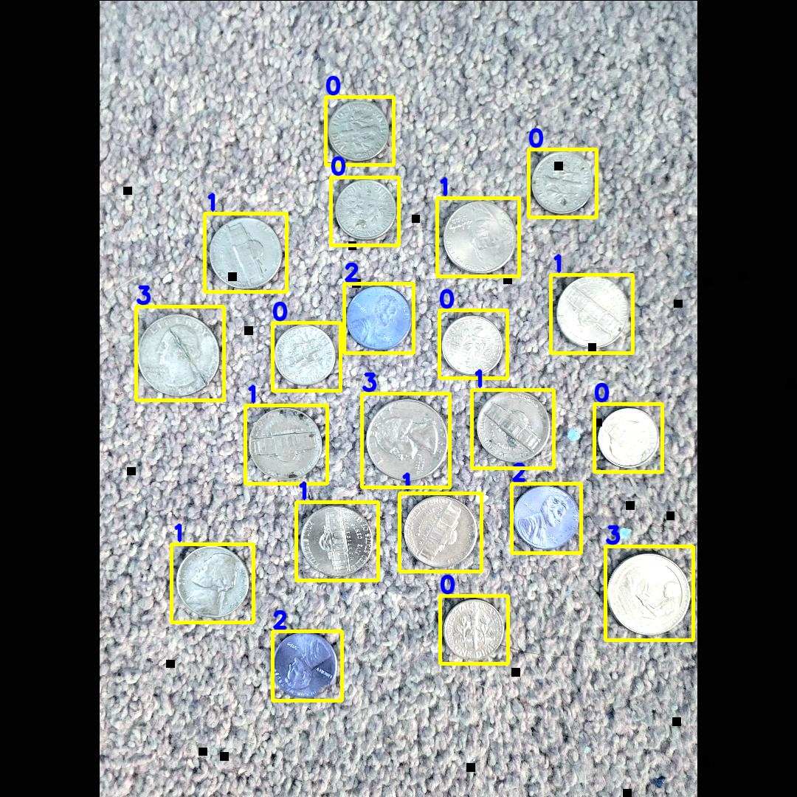

# Yolo, COCO, Pascal-VOC format detection annotations reading and plotting

## Intro

A Simple code for reading and plotting detection annotations. Yolo, COCO, Pascal-VOC formats are choosen.

This example (sample) is from [u.s.-coins-dataset](https://universe.roboflow.com/atathamuscoinsdataset/u.s.-coins-dataset-a.tatham). The file names and the content of the annotations are untouched (original files).

Coco:
* `[x_min, y_min, width, height]`
* The coordinates (`x_min`, `y_min`) are the top-left corner along with the `width` and `height` of the bounding box.

Pascal_VOC:
* `​[x_min, y_min, x_max, y_max]`​
* `x_min` and `y_min` are coordinates of the top-left corner and `x_max` and `y_max` are coordinates of bottom-right corner of the bounding box.

Yolo:
* `​[x_center/image_width, y_center/image_height, width/image_width, height/image_height]`
* `x_center` and `y_center` are the normalized coordinates of the centre of the bounding box. The `width` and `height` are the normalized length. To convert YOLO in Coco or Pascal or vice versa it is important to have the size of the image(`image_width`, `image_height`) to calculate the normalization.

## Plot

